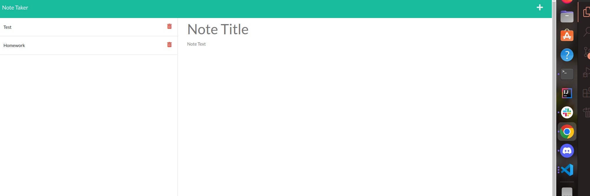

# Note-Taker-MS

## Table of Contents
-[Description](#description) 
-[Installation](#installation) 
-[Usage](#usage)
-[License](#license)
-[Contributing](#contributing) 
-[Tests](#tests) 
-[Questions](#questions) 
-[Depolyment](#depolyment)

## Description of the Project


## Installation
To create this project, follow these several steps. This application uses Node.js and express (verison 4.16.4) and nodemon (verison 2.0.19). Step one, download Node.js. Next go to the terminal of the index.js and type this command ```npm install```. This creates package.json file. 


## Usage
To use this application, open the terminal, respective to the file. Run the ```nodemon server.js``` in the terminal. Finally, the Database will be updated with recent notes. 

This is what the index.html will look like when deployed.



## License
This application does not require any licenses.

## Contributing
If you would like to contribute to this project, please email me. My email can be found in the Questions section.

## Tests
Currently, there is no tests for this project.

## Questions

For more information about this application, please email me at melissastan91@gmail.com. Interested in my work? Checkout my GitHUb repositories. My GitHub username is mstan19, and here is my GitHub profile: https://github.com/mstan19.

## Video
Click on this link for the demo of this application.
https://drive.google.com/file/d/1Tmox-hiMAkAiadZhL6NV80Dulyp6LmVi/view?usp=sharing

## Depolyment
Click on this link for deployed application
https://github.com/mstan19/note-taker-ms